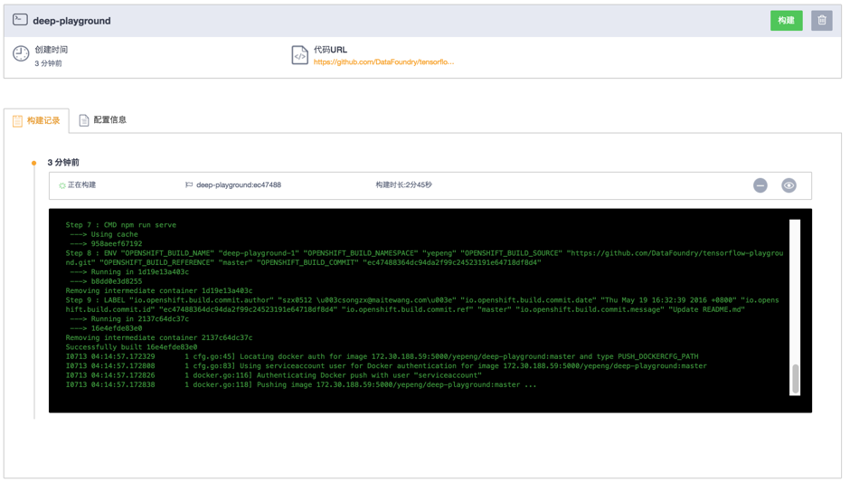
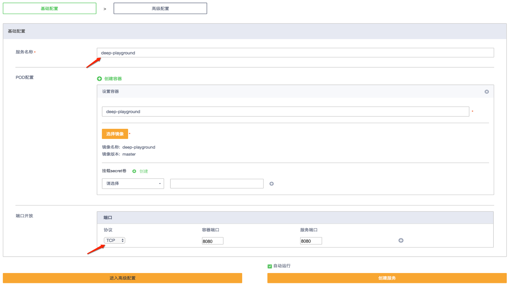
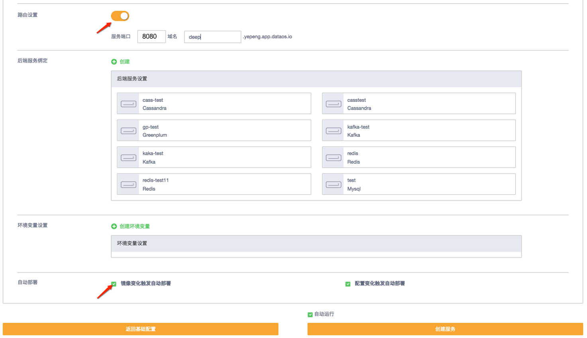

# 第一节：第一个应用 - TensorFlow Playground

> 本教程基于 DataFoundry 经典界面编写，考虑到产品的快速演进，部分步骤和图示可能已经改变。

## 1 第一节所覆盖的知识点

在第一节，我们将学会如何进行：
- 代码构建
- 服务部署

## 2 关于“Deep playground”应用

"Deep playground"是一个交互式可视化 nodejs 应用，它通过 d3.js 以动态方式演示了一个神经网络模型的训练过程。
在本节我们将通过 DataFoundry 平台部署 Deep playground。

## 3 开始前的准备工作

在你开始之前，你需要在 DataFoundry 注册一个帐号。

对于图形界面操作，你还需要以下浏览器之一：

- Firefox 15 或以上
- Chrome 21 或以上
- Internet Explorer 10 或以上
- Safari 7 或以上

对于命令行操作，你还需要下载 OpenShift 客户端：

- [Windows](https://s3.cn-north-1.amazonaws.com.cn/complier/oc-control.zip)
- [Mac](https://s3.cn-north-1.amazonaws.com.cn/complier/openshift-origin-client-tools-v1.1.0.1-bf56e23-mac.zip)
- [Linux](https://s3.cn-north-1.amazonaws.com.cn/complier/openshift-origin-client-tools-v1.1.0.1-bf56e23-linux)

Fork deep playground源码到自己的代码仓库

- 预置 dockerfile 版，[https://github.com/DataFoundry/tensorflow-playground.git](https://github.com/DataFoundry/tensorflow-playground.git)   
- 官方版（需准备 dockerfile），[https://github.com/tensorflow/playground.git  ](https://github.com/tensorflow/playground.git)

## 4 Step by Step 详细操作

下面分别对图形界面和命令行两种方式进行介绍。

### 4.1 图形界面操作

#### Step 1：代码构建

1）登录平台：

2）在左侧菜单中点击“代码构建”：

3）点击“新建构建”并选择 deep playground 代码库，点击“开始构建”：

4）查看构建进度：

5）构建完成后点击“查看镜像”：

6）点击“部署最新版本”：

7）填写服务基本信息：

- 填写“服务名称”
- 选择“端口开放协议”
- 填写“容器端口”及“服务端口”

8）填写服务高级信息：
- 点击“路由配置”并选择容器端口、填写域名信息
- 点击“镜像变化触发自动部署”

9）通过路由访问应用：

10) 大功告成：
