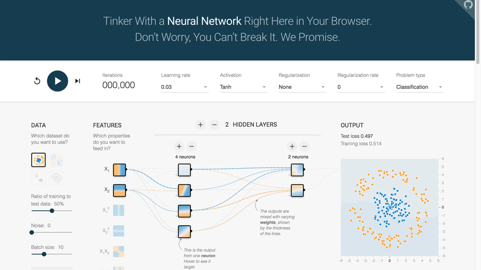
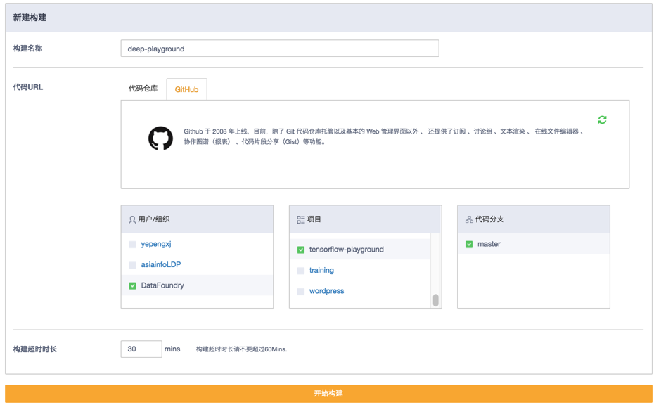
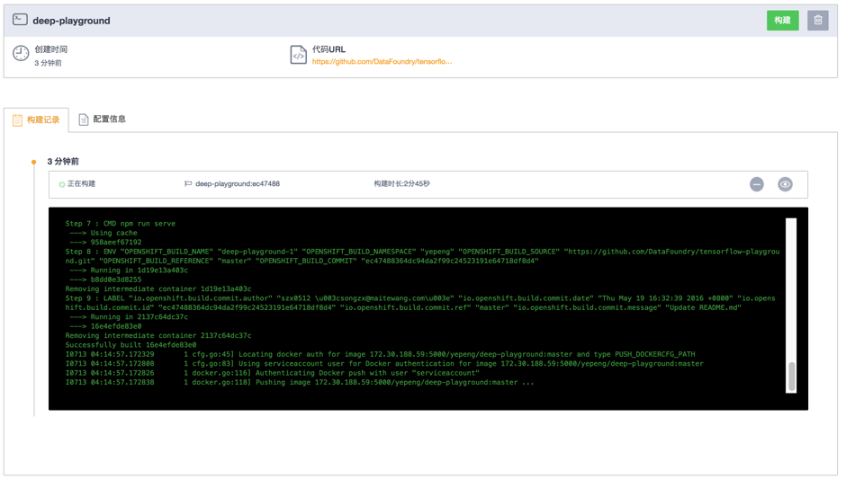
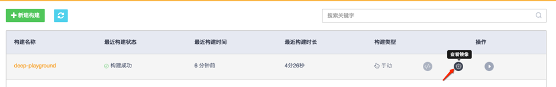
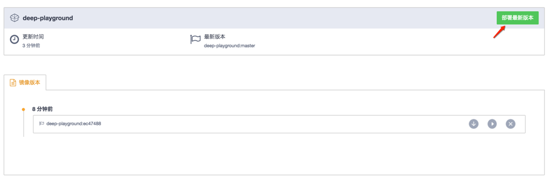
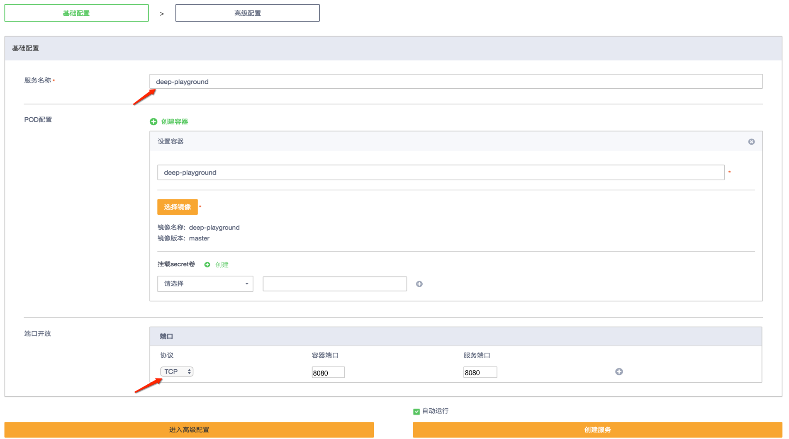
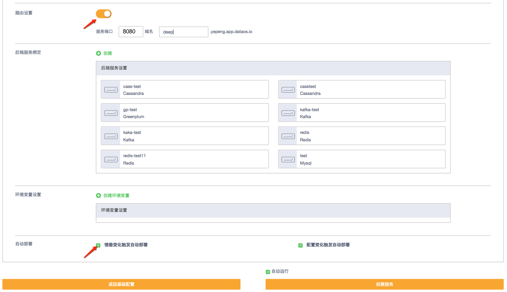
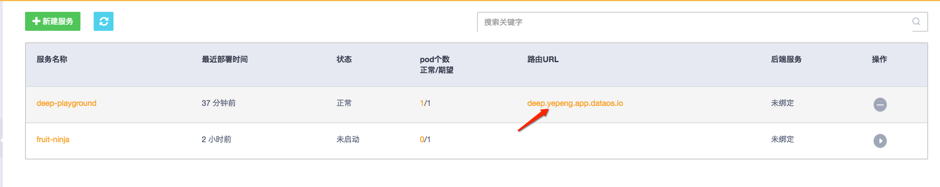

# 第一节 小试牛刀

> 本教程基于 DataFoundry 经典界面编写，考虑到产品的快速演进，部分步骤和图示可能已经改变。

为了更好地向你介绍 DataFoundry 各种功能，我们编写了这个系列教程，共包含四个章节：
- 第一节，（小试牛刀），你将学习如何通过代码构建和服务部署来部署一个简单应用；
- 第二节，搭建 WordPress 应用，你将学习如何使用 DataFoundry 后端服务来部署应用；
- 第三节，（XXX），你将学习如何使用 DataFoundry 的 DevOps 功能进行 CICD；
- 第四节，（XXX），你将学习如何进行 User Provided Service 实例的创建、部署，并于后端服务绑定。

## 1 第二节所覆盖的知识点

在第一节，我们将学会如何进行：
- 代码构建
- 服务部署

## 2 关于“Deep playground”应用

"Deep playground"是一个交互式可视化nodejs应用，它通过d3.js已动态方式演示了一个神经网络模型的训练过程。
在本节我们将通过datafoundry平台部署Deep playground

## 3 开始前的准备工作

在你开始之前，你需要在 DataFoundry 注册一个帐号。

对于图形界面操作，你还需要以下浏览器之一：
- Firefox 15 或以上
- Chrome 21 或以上
- Internet Explorer 10 或以上
- Safari 7 或以上

对于命令行操作，你还需要下载 OpenShift 客户端：
- [Windows](https://s3.cn-north-1.amazonaws.com.cn/complier/oc-control.zip)
- [Mac](https://s3.cn-north-1.amazonaws.com.cn/complier/openshift-origin-client-tools-v1.1.0.1-bf56e23-mac.zip)
- [Linux](https://s3.cn-north-1.amazonaws.com.cn/complier/openshift-origin-client-tools-v1.1.0.1-bf56e23-linux)

Fork deep playground源码到自己的代码仓库
- 预置dockerfile版，https://github.com/DataFoundry/tensorflow-playground.git   
- 官方版（需准备dockerfile），https://github.com/tensorflow/playground.git  
## 4 Step by Step 详细操作

下面分别对图形界面和命令行两种方式进行介绍。

### 4.1 图形界面操作

#### Step 1：代码构建

1）登录平台：

2）在左侧菜单中点击“代码构建”：

3）点击“新建构建”并选择deep playground代码库，点击“开始构建”

4）查看构建进度

5）构建完成后点击“查看镜像”

6）点击“部署最新版本”

7）填写服务基本信息
- 填写“服务名称”
- 选择“端口开放协议”
- 填写“容器端口”及“服务端口”

8）填写服务高级信息
- 点击“路由配置”并选择容器端口、填写域名信息
- 点击“镜像变化触发自动部署”

9）通过路由访问应用

10) 大功告成
