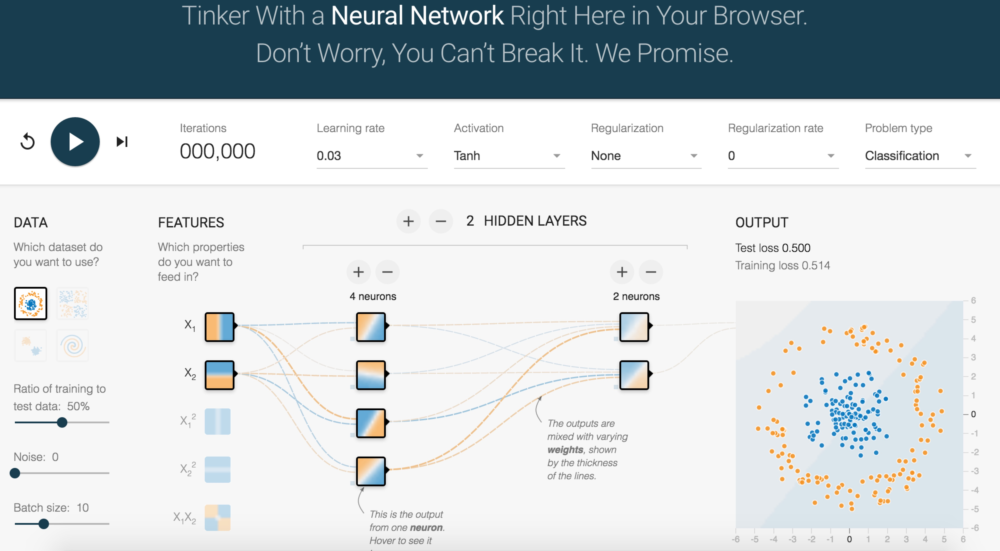

# 第一节 小试牛刀

> 本教程基于 DataFoundry 经典界面编写，考虑到产品的快速演进，部分步骤和图示可能已经改变。

为了更好地向你介绍 DataFoundry 各种功能，我们编写了这个系列教程，共包含四个章节：
- 第一节，（小试牛刀），你将学习如何通过代码构建和服务部署来部署一个简单应用；
- 第二节，搭建 WordPress 应用，你将学习如何使用 DataFoundry 后端服务来部署应用；
- 第三节，（XXX），你将学习如何使用 DataFoundry 的 DevOps 功能进行 CICD；
- 第四节，（XXX），你将学习如何进行 User Provided Service 实例的创建、部署，并于后端服务绑定。

## 1 第二节所覆盖的知识点

在第一节，我们将学会如何进行：
- 代码构建
- 服务部署

## 2 关于“Deep playground”应用

"Deep playground"是一个交互式可视化nodejs应用，它通过d3.js已动态方式演示了一个神经网络模型的训练过程。

在本节我们将通过datafoundry平台部署Deep playground
